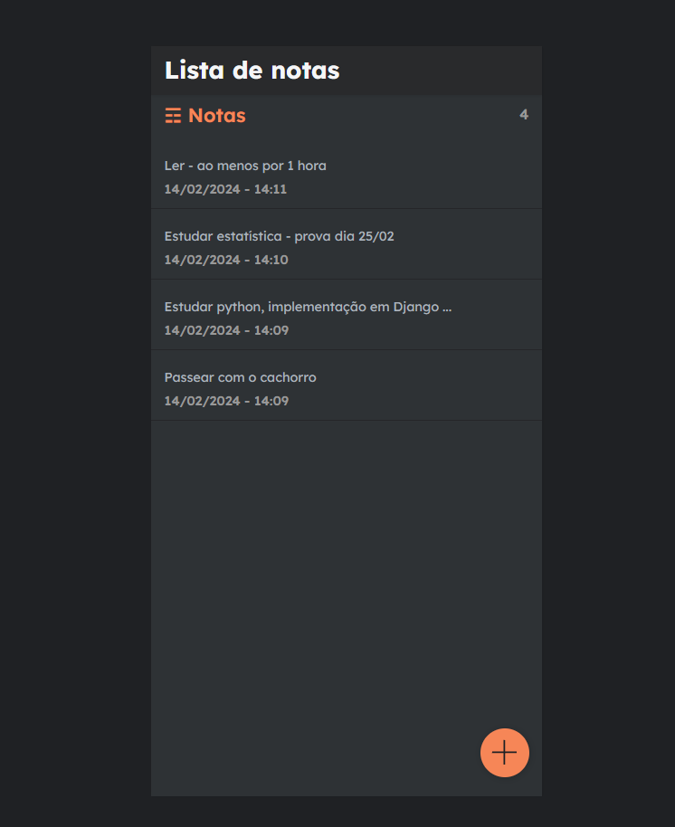

# Bloco de notas
 <br />

### Projeto desenvolvido:


O bloco de notas foi desenvolvido para fins de estudo em python, e em seu framework Django Rest
As funcionalidades incluem:
- Modo noturno/diurno
- Cadastro de notas
- Edição de notas
- Visualização de notas - organizado por data de edição

### Como executar localmente?
1. Antes de tudo, é necessário ter o node e o python instalados no seu computador:
- https://nodejs.org/en/download
- https://www.python.org/downloads/
2. Em seguida, instale o pip (package manager do python) seguindo os passos da documentação: https://pip.pypa.io/en/stable/installation/
3. Clone o repositório na sua máquina local
4. Execute o seguinte comando na raiz do projeto: <br />
```py manage.py migrate``` - Ele será responsável por adicionar as tabelas no seu banco de dados local (já gerenciado pelo SQLite)
5. Para rodar o backend, basta executar ```py manage.py runserver``` no mesmo diretório do passo anterior (raiz)
6. Para deixar o frontend pronto para executar, basta entrar na pasta por meio de ```cd views```, instalar as dependências com ```npm i``` ou ```yarn``` (dependendo de qual gerenciador de pacotes você utilizar)
7. Por fim, para rodar o frontend basta apenas rodar ```npm start``` - ainda na pasta views
